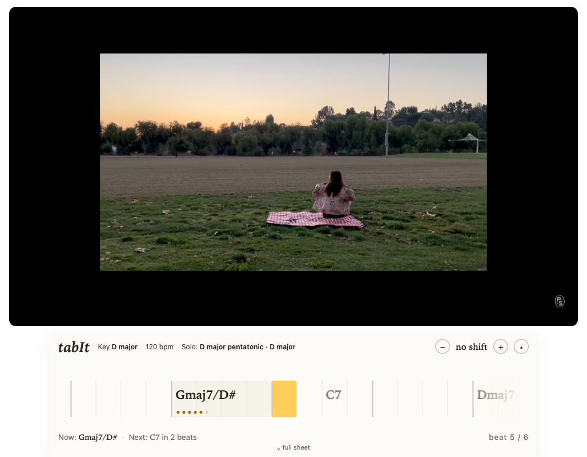
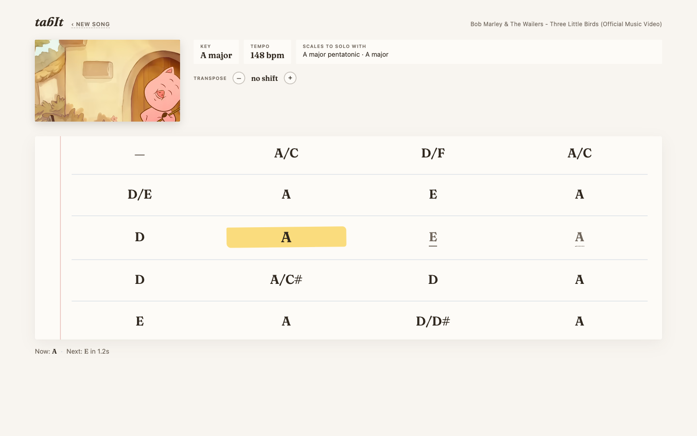
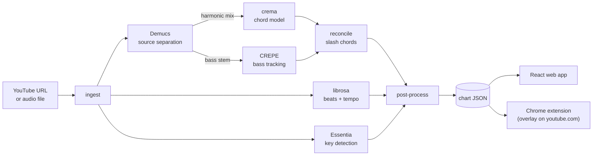

<div align="center">

<picture>
  <source media="(prefers-color-scheme: dark)" srcset="docs/assets/logo-dark.svg">
  
</picture>

**paste a song, follow the chords, play along**

Turn any song into a synced, play-along guitar chord sheet, embedded right under the
YouTube video you're watching: chords, key, suggested scales, even slash chords,
followed karaoke-style as the music plays.

     

</div>



<p align="center"><sub>tabIt on youtube.com, mid-song. No separate site: the extension embeds the chords directly under the video you're already watching. The amber cell sweeps beat by beat; <strong>Gmaj7/D#</strong> is playing now and <strong>C7</strong> lands in two beats.</sub></p>

## Why this exists

Play-along chord sites are cluttered, ad-heavy, and only cover songs someone bothered to
transcribe. tabIt transcribes the song for you, right where you're already listening:
open a YouTube video, click the "♪ Get chords" bar that appears under the player, and
the chords embed themselves beneath the video. No separate site, no copy-pasting a URL,
no accounts.

- **Lives under the video.** The Chrome extension expands into a beat ribbon: one cell
  per detected beat, an amber sweep on the moment, the next change always visible before
  it arrives. Ad-aware (it pauses with the ad), SPA-navigation safe, and the full paper
  sheet is one click away.
- **Karaoke-style following.** The current chord is always obvious at a glance; the next
  chord is flagged before it arrives, so your hands are ready.
- **Slash chords.** The chord model runs on the drums-removed harmonic mix while a pitch
  tracker follows the isolated bass stem; the two are reconciled to emit inversions like
  `A/C#`. Most tools skip this entirely.
- **Honest confidence.** Chord detection is imperfect (state of the art is ~72% on
  7th chords; human experts only agree ~54% on complex ones). Low-confidence chords are
  visibly softer with a dotted underline, never hidden. Click any chord to correct it;
  edits persist locally.
- **Practice-friendly.** Key, tempo, and scale chips at the top; one-tap transpose;
  auto-scroll that keeps the current line in view.
- **Fast after the first time.** Cold analysis takes 1 to 3 minutes (download, source
  separation, detection). Every repeat of the same song is served instantly from a disk
  cache.

## The web app: the whole chart on paper

Prefer the full chart, or have a local audio file instead of a YouTube link? The web
app renders the entire song as a songbook-style sheet, synced to playback the same way.



<p align="center"><sub>A real run, not a mockup. Amber highlighter marks the chord playing <em>now</em>; the pencil underline marks what's <em>next</em>; a dotted underline means the engine isn't sure and says so.</sub></p>

## How it works

Three layers share one contract: the **chart JSON**. The web app and the Chrome
extension are both just renderers of it.



| Layer | What | Status |
|---|---|---|
| **MIR engine** (Python) | audio → chords + key + scales + beat grid → chart JSON | ✅ complete |
| **Web app** (FastAPI + React) | paste URL / drop file → YouTube player + synced sheet | ✅ complete |
| **Chrome extension** (MV3) | the same sheet overlaid below the player on youtube.com | ✅ complete |

## Quick start

### 1. Engine + API

Requires Python 3.11. Plain `pip install -e ".[dev]"` is **not sufficient**: crema's
legacy build needs an old `setuptools`, so the build step is constrained separately.

```bash
python3.11 -m venv .venv && source .venv/bin/activate
pip install -e ".[dev]" --build-constraint constraints-build.txt
```

### 2. Chrome extension

With the API from step 1 running:

```bash
# terminal 1: API
source .venv/bin/activate
uvicorn api.main:app --port 8000

# terminal 2: build the extension
cd extension && npm install && npm run build
```

Load `extension/dist` as an unpacked extension at `chrome://extensions`
(Developer mode → Load unpacked), then open any YouTube video and click the
"♪ Get chords" bar that appears below the player. It expands into the beat
ribbon — Shadow-DOM isolated, SPA-navigation safe, ad-aware. Verified end-to-end on
real YouTube with a headful Playwright run (cached chart renders in ~50 ms; the
marker tracks playback across chord boundaries; teardown/remount survives SPA
navigation).

### 3. Web app

```bash
# with the API running (terminal 1 above)
cd web && npm install && npm run dev   # http://localhost:5173
```

Paste a YouTube URL or drop an audio file on the landing page. Analyzed charts are
cached in `data/charts/`, keyed by video ID and engine version.

### CLI only

The engine runs standalone if you just want the chart JSON:

```bash
python -m engine.cli <youtube-url|audio-file> -o chart.json
```

## Honest about accuracy

This is a portfolio and learning project, and it doesn't pretend otherwise. The
measured regression floor (0.495 weighted majmin accuracy via `mir_eval`) comes from a
**synthetic** Am→F→C→G fixture, which is out-of-distribution for a model trained on
real recordings, so it says nothing about accuracy on an actual song. A hand-labeled
real-song accuracy floor is on the roadmap. What the product does instead of promising
precision: it shows per-chord confidence and makes corrections one click away.

## Project layout

```
engine/      Python MIR pipeline: audio in, chart JSON out
api/         FastAPI wrapper: analyze endpoints, job store, disk cache
web/         Vite + React app: player + synced chord sheet
extension/   Chrome MV3 extension: the sheet overlaid on youtube.com
data/charts/ cached analyses (videoId @ engine version)
docs/        design specs, implementation plans, progress ledger
```

## Roadmap

- [x] Extension: degraded mount fallback + live-stream guard
- [x] Extension: headful Playwright e2e against real YouTube
- [ ] Quieter slash chords: emit `X/Y` only when the bass is confident *and* on a chord tone
- [ ] Real-song accuracy floor (licensed/self-recorded, hand-labeled)
- [ ] Song sections (verse/chorus) via allin1
- [ ] Animated demo in this README (screen-recorded GIF/MP4 of the ribbon sweeping in time)
- [ ] Package the extension for the Chrome Web Store; deploy the API + web app

The full per-task build ledger lives in [docs/PROGRESS.md](docs/PROGRESS.md), with the
design specs and implementation plans in [`docs/superpowers/`](docs/superpowers/).

## Built with

| | |
|---|---|
| [Demucs](https://github.com/facebookresearch/demucs) | source separation (harmonic mix + bass stem) |
| [crema](https://github.com/bmcfee/crema) | chord recognition |
| [librosa](https://librosa.org) | beat and tempo tracking |
| [Essentia](https://essentia.upf.edu) | key detection |
| [CREPE](https://github.com/marl/crepe) | bass pitch tracking |
| [mir_eval](https://github.com/mir-evaluation/mir_eval) | accuracy harness |
| [FastAPI](https://fastapi.tiangolo.com) · [React 19](https://react.dev) · [Vite](https://vite.dev) · [esbuild](https://esbuild.github.io) | the app around the engine |

## License

[MIT](LICENSE) © Paolo Sandejas
