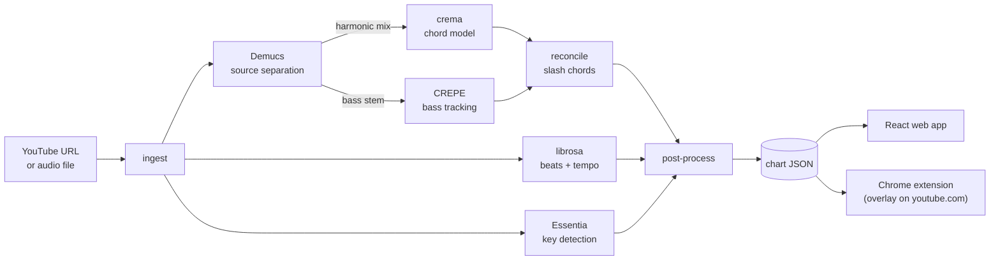

<div align="center">

<picture>
  <source media="(prefers-color-scheme: dark)" srcset="docs/assets/logo-dark.svg">
  
</picture>

**paste a song, follow the chords, play along**

Turn any song into a synced, play-along guitar chord sheet, embedded right under the
YouTube video you're watching: chords, key, suggested scales, even slash chords,
followed karaoke-style as the music plays.

[](https://github.com/paolosand/tabIt/actions/workflows/ci.yml)      

</div>


<p align="center"><sub>A real recording on youtube.com. No separate site: click the "♪ Get chords" bar under the video you're already watching and the beat ribbon embeds itself, sweeping beat by beat with the next chord always in sight.</sub></p>

## Why this exists

It started with a familiar moment: you're watching a video, the song grabs you, and you
want to play along right now. tabIt lives inside that moment. Click the "♪ Get chords"
bar under any YouTube video and the chords embed themselves right there, synced to
playback, guitar still in hand.

The other half is coverage. Chord sites can only offer what someone has transcribed,
and plenty of what you'd love to play has no tab anywhere: an unreleased song, a live
version, a friend's demo, your own recordings. tabIt detects the chords from the audio
itself, so you can play along to practically anything.

- **Lives under the video.** The Chrome extension expands into a beat ribbon: one cell
  per detected beat, an amber sweep on the moment, the next change always visible before
  it arrives. Ad-aware (it pauses with the ad), SPA-navigation safe, and the full paper
  sheet is one click away.
- **Karaoke-style following.** The current chord is always obvious at a glance; the next
  chord is flagged before it arrives, so your hands are ready.
- **Slash chords.** The chord model runs on the drums-removed harmonic mix while a pitch
  tracker follows the isolated bass stem; the two are reconciled to emit inversions like
  `A/C#`. Most tools skip this entirely.
- **Honest confidence.** Chord detection is imperfect (state of the art is ~72% on
  7th chords; human experts only agree ~54% on complex ones). Low-confidence chords are
  visibly softer with a dotted underline, never hidden. Click any chord to correct it;
  edits persist locally.
- **Practice-friendly.** Key, tempo, and scale chips at the top; one-tap transpose;
  auto-scroll that keeps the current line in view.
- **Fast after the first time.** Cold analysis takes well under a minute on an
  Apple-Silicon Mac (~36s of compute for a 3.5-minute song: GPU source separation,
  detection stages running in parallel, models kept warm) plus the download; a few
  minutes on CPU-only machines. While it runs, the bar shows each pipeline step
  live (download, separation, chords) instead of a blank spinner. Every repeat of
  the same song is served instantly from a disk cache.

## How it works

Three layers share one contract: the **chart JSON**. The web app and the Chrome
extension are both just renderers of it.



| Layer | What | Status |
|---|---|---|
| **MIR engine** (Python) | audio → chords + key + scales + beat grid → chart JSON | ✅ complete |
| **Web app** (FastAPI + React) | paste URL / drop file → YouTube player + synced sheet | ✅ complete |
| **Chrome extension** (MV3) | the same sheet overlaid below the player on youtube.com | ✅ complete |

## Quick start

### 1. Engine + API

Requires Python 3.11. Plain `pip install -e ".[dev]"` is **not sufficient**: crema's
legacy build needs an old `setuptools`, so the build step is constrained separately.

```bash
python3.11 -m venv .venv && source .venv/bin/activate
pip install -e ".[dev]" --build-constraint constraints-build.txt
```

#### Or: one-line install (macOS, beta)

Skip the manual environment entirely. The installer provisions Python 3.11
via [uv](https://docs.astral.sh/uv/), a static ffmpeg, and all model weights,
then runs the API as a background service that starts at login. It installs
the latest tagged release, not main:

```bash
curl -fsSL https://raw.githubusercontent.com/paolosand/tabIt/main/packaging/install.sh | sh
```

Manage it with `tabit status` / `tabit logs` / `tabit restart` /
`tabit uninstall`. Charts cache to `~/Library/Application Support/tabIt/charts`,
logs to `~/Library/Logs/tabIt/helper.log`. If the helper is off, the extension
bar says so and recovers by itself once the service is back.

### 2. Chrome extension

With the API from step 1 running (already the case if you used the one-line
installer — the helper serves it as a background service):

```bash
# terminal 1: API — skip if you used the one-line installer
source .venv/bin/activate
uvicorn api.main:app --port 28224

# terminal 2: build the extension
cd extension && npm install && npm run build
```

Load `extension/dist` as an unpacked extension at `chrome://extensions`
(Developer mode → Load unpacked), then open any YouTube video and click the
"♪ Get chords" bar that appears below the player. It expands into the beat
ribbon — Shadow-DOM isolated, SPA-navigation safe, ad-aware. Verified end-to-end on
real YouTube with a headful Playwright run (cached chart renders in ~50 ms; the
marker tracks playback across chord boundaries; teardown/remount survives SPA
navigation).

### 3. Web app (optional)

The extension is the product; the web app is the dev-facing renderer of the
same chart JSON — and the only UI for **local audio files** (the extension is
YouTube-only). It shows the whole song as a songbook-style sheet, synced to
playback the same way.

```bash
# with the API running (terminal 1 above)
cd web && npm install && npm run dev   # http://localhost:5173
```

Paste a YouTube URL or drop an audio file on the landing page. Analyzed charts are
cached in `data/charts/`, keyed by video ID and engine version.

### CLI only

The engine runs standalone if you just want the chart JSON:

```bash
python -m engine.cli <youtube-url|audio-file> -o chart.json
```

## Honest about accuracy

This is a portfolio and learning project, and it doesn't pretend otherwise. The
measured regression floor (0.495 weighted majmin accuracy via `mir_eval`) comes from a
**synthetic** Am→F→C→G fixture, which is out-of-distribution for a model trained on
real recordings, so it says nothing about accuracy on an actual song. A hand-labeled
real-song accuracy floor is on the roadmap. What the product does instead of promising
precision: it shows per-chord confidence and makes corrections one click away. Since
engine 0.2.0, a conservatism pass also keeps the noise down: slash chords appear only
when the detected bass is confident *and* a chord tone, low-confidence exotic qualities
simplify to plain triads, sub-2-beat flicker segments merge away, and a meter detector
(chord changes land on downbeats) gives the chart real bar lines instead of assuming 4/4.

## Project layout

```
engine/      Python MIR pipeline: audio in, chart JSON out
api/         FastAPI wrapper: analyze endpoints, job store, disk cache
web/         Vite + React app: player + synced chord sheet
extension/   Chrome MV3 extension: the sheet overlaid on youtube.com
data/charts/ cached analyses (videoId @ engine version)
docs/        design specs, implementation plans, progress ledger
```

## Roadmap

- [x] Extension: degraded mount fallback + live-stream guard
- [x] Extension: headful Playwright e2e against real YouTube
- [x] Quieter slash chords: emit `X/Y` only when the bass is confident *and* on a chord tone
- [x] Animated demo in this README (screen-recorded GIF of the ribbon sweeping in time)
- [x] Live pipeline-step checklist in the extension bar while a song analyzes
- [x] macOS helper: one-line installer, launchd service, `tabit` CLI, extension offline state
- [ ] Real-song accuracy floor (licensed/self-recorded, hand-labeled)
- [ ] Song sections (verse/chorus) via allin1
- [ ] Package the extension for the Chrome Web Store (pre-built zip release as a stopgap)
- [ ] Signed menubar app — download, guided setup, no terminal (packaging Phase 2)

The full per-task build ledger lives in [docs/PROGRESS.md](docs/PROGRESS.md), with the
design specs and implementation plans in [`docs/superpowers/`](docs/superpowers/).

## Built with

| | |
|---|---|
| [Demucs](https://github.com/facebookresearch/demucs) | source separation (harmonic mix + bass stem) |
| [crema](https://github.com/bmcfee/crema) | chord recognition |
| [librosa](https://librosa.org) | beat and tempo tracking |
| [Essentia](https://essentia.upf.edu) | key detection |
| [CREPE](https://github.com/marl/crepe) | bass pitch tracking |
| [mir_eval](https://github.com/mir-evaluation/mir_eval) | accuracy harness |
| [FastAPI](https://fastapi.tiangolo.com) · [React 19](https://react.dev) · [Vite](https://vite.dev) · [esbuild](https://esbuild.github.io) | the app around the engine |

## License

[MIT](LICENSE) © Paolo Sandejas
